# Application Web Microservices avec Kubernetes & Helm


## Table des matières

- [Table des matières](#table-des-matières)
- [Introduction](#introduction)
- [Architecture de l'application](#architecture-de-lapplication)
- [Déployer l'application](#déployer-lapplication)
- [Flow d'exécution des services](#flow-dexécution-des-services)
- [Kyverno](#kyverno)
  - [Kyverno integration](#kyverno-integration)
  - [Admission Policies](#admission-policies)
  - [Mutation Policies](#mutation-policies)
    - [Ajouter une annotation aux services déployés](#ajouter-une-annotation-aux-services-déployés)
    - [Ajouter les labels au bon fonctionnement d'istio](#ajouter-les-labels-au-bon-fonctionnement-distio)
- [Falco](#falco)
  - [Default Falco Rules : quelques exemples](#default-falco-rules--quelques-exemples)
  - [Custom Falco Rules](#custom-falco-rules)
- [Istio](#istio)
  - [Peer Authentication](#peer-authentication)
- [Commandes utiles HELMFILE](#commandes-utiles-helmfile)

## Introduction

Ce projet consiste à déployer une application web composée de trois services dans un cluster Kubernetes local. Voici les spécifications du projet :

## Architecture de l'application

1. **Aggregator API (gateway)**  
   - Service principal exposé au public.  
   - Reçoit des requêtes HTTP et interagit avec les deux microservices suivants.  
   - Compose une phrase en combinant les réponses des microservices.

2. **Microservice Names**  
   - Génère des noms aléatoires.  

3. **Microservice Verbs**  
   - Génère des verbes aléatoires.  
   - Génère des adverbes aléatoires.

## Déployer l'application

1. Créer un cluster K3D avec 3 noeuds :  
```bash
k3d cluster create ssi-cluster 
```

> [!TIP]
>  Vous pouvez vérifier le contexte actuel de votre cluster avec la commande suivante :

 ```bash
kubectl config current-context
```

2. Build des images Docker depuis le folder `microservices` :

Build `nonRootUser` et `rootUser` images :  
```bash
docker compose -f docker-compose.non-root-user.yaml -f docker-compose.root-user.yaml build
```

3. Importer les images `rootUser` et `nonRootUser` dans le cluster K3D :

Depuis le folder `kubernetes/scripts` :

```bash
chmod +x import-kd3-images.sh && ./import-kd3-images.sh
```

5. Déployer les services par default `rootUser` depuis le folder `kubernetes/helmfiles` :  

```bash
helmfile sync
```

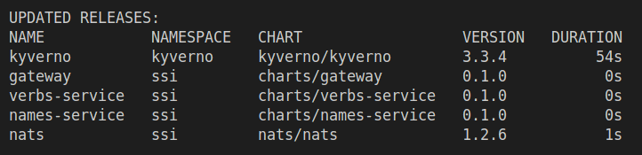

6. Port-forwarding pour accéder à l'application :  
```bash
kubectl port-forward svc/gateway 3000:3000
# Ou "Shift+F" pour port-forwarding depuis K9S.
```
> [!NOTE] 
> L'application est accessible à l'adresse `http://localhost:3000`

7. Port-forwarding pour accéder à l'interface web Kiali :  
```bash
kubectl port-forward svc/kiali -n istio-system 20001:20001
```

## Flow d'exécution des services

Le fichier `helmfile.yaml` décrit le déploiement ainsi l'ordre des services en utilisant des dépendances. À l'aide des propriétés `needs` et `wait` et `waitForJobs`, Helmfile assure que les services sont déployés dans l'ordre correct : Istio puis Kyverno avant de déployer NATS puis que NATS soit opérationnel avant de déployer les services `gateway`, `names-service` et `verbs-service`.

## Kyverno

### Kyverno integration

Pour s'assurer que Kyverno est prêt avant de déployer les services, un script bash [kyverno-ready.sh](./kubernetes/scripts/kyverno-ready.sh) est exécuté afin de vérifier l'état des `ClusterPolicies`. Le script est exécuté automatiquement par Helmfile à l'aide d'un hook `postsync`.

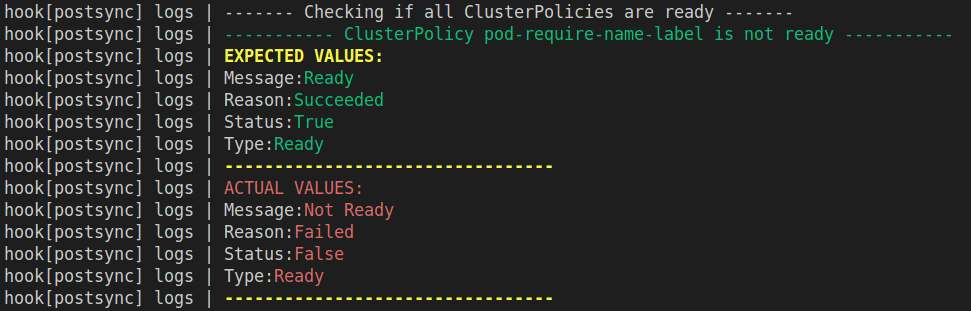

### Admission Policies 

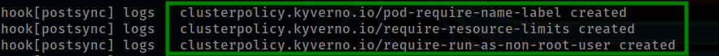


1. Pod(s) require name label [manifests/require-name-label.yaml](./kubernetes/manifests/require-name-label.yaml)

Cette politique Kyverno assure que tous les pods déployés dans le cluster Kubernetes possèdent une étiquette spécifique `app.kubernetes.io/name:`. Elle exclut les namespaces kube-system et kyverno de cette vérification.

En cas de non respect de cette politique, un pod sera refusé par le contrôleur d'admission Kyverno.

**Reproduire l'erreur :** 

Pour reproduire les erreurs `require-label` , il suffit vous rendre dans le folder `kubernetes/helmfiles/values` puis de décommenter la ligne `kyverno.failed/name` dans un des fichier `gateway.yaml` et de relancer le déploiement avec `helmfile sync`.

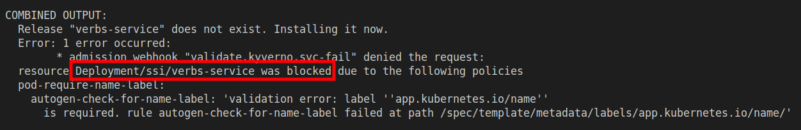

---

2. Non root user in containers [manifests/require-run-as-non-root-user.yaml](./kubernetes/manifests/require-run-as-non-root-user.yaml)

Cette politique Kyverno assure que les conteneurs déployés dans le cluster Kubernetes n'utilisent pas l'utilisateur `root`. En cas de non respect de cette politique, un pod sera refusé par le contrôleur d'admission Kyverno.

**Reproduire l'erreur :** 

Pour reproduire les erreurs `run-as-non-root` , il suffit vous rendre dans le folder `kubernetes/helmfiles/values` puis de décommenter la ligne `runAsRoot: false` dans le fichier `gateway.yaml` et de relancer le déploiement avec `helmfile sync`. 

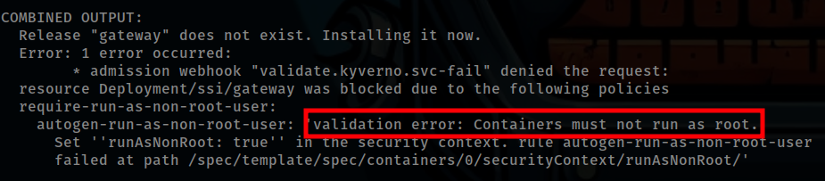

>**Important :** Si `runAsNonRoot` est défini sur `true` mais que le conteneur lui-même s'exécute en tant que ROOT, Kyverno ne pourra pas vérifier si le conteneur s'exécute correctement en tant que non-root. Cette vérification est effectuée par le contrôleur Kubernetes à l'aide de la politique de sécurité `SecurityContext`.


---

3. Vaildate resource limits (CPU, Memory) [manifests/require-resource-limits.admission.yaml](./kubernetes/manifests/require-resource-limits.admission.yaml)

Cette politique Kyverno assure que les conteneurs déployés dans le cluster Kubernetes ont des limites de ressources définies pour le CPU et la mémoire. En cas de non respect de cette politique, un pod sera refusé par le contrôleur d'admission Kyverno.

**Reproduire l'erreur :** 

Pour reproduire les erreurs `require-resource-limits` , il suffit vous rendre dans le folder `kubernetes/helmfiles/values` puis de décommenter la ligne `resources: {}` dans le fichier `gateway.yaml` et de relancer le déploiement avec `helmfile sync`. 

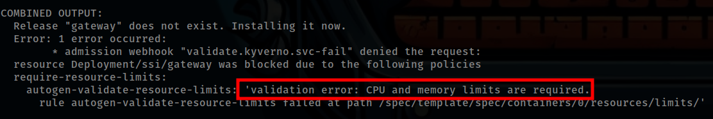


### Mutation Policies

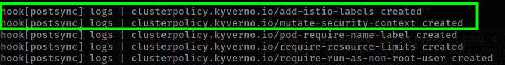

#### Ajouter une annotation aux services déployés

**Good practices :**
Chaque service `mutated` par Kyverno heritera par default de l'annotation `kyverno.io/mutated: "true"`. (See [mutate-security-context](./kubernetes/manifests/mutate-security-context.yaml))

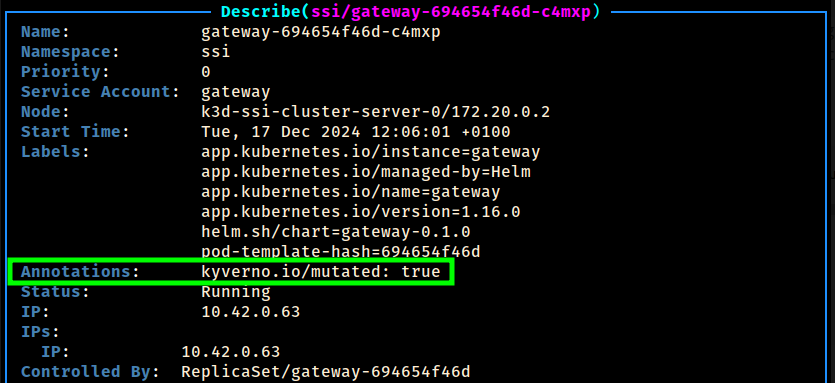


#### Ajouter les labels au bon fonctionnement d'istio

**Good practices :**
Afin que Istio puisse marcher correctement il est nécessaire d'ajouter les labels `app` et `version` à chaque pod déployé. (See [mutate-istio-labels](./kubernetes/manifests/network-policies/mutate-istio-labels.yaml))

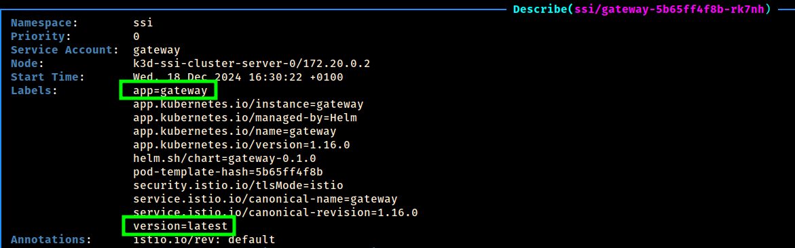


## Falco 

### Default Falco Rules : quelques exemples

> [!NOTE]
> Vous pouvez accéder aux rules de falco configurer par default depuis le service dans `etc/falco/falco_rules.yaml`.

1. **Detecting shell in container**  
   - Cette règle Falco détecte l'utilisation d'un shell dans un conteneur.  
   - Pour reproduire cette règle, vous pouvez exécuter un shell dans un conteneur en utilisant la commande `kubectl exec -it <pod-name> -- /bin/sh`.

Pour tester la règle, vous pouvez exécuter un shell dans un conteneur en utilisant la commande `kubectl exec -it <pod-name> -- /bin/sh`.

Puis vérifier depuis la WebUI de Falco si la règle a été déclenchée.

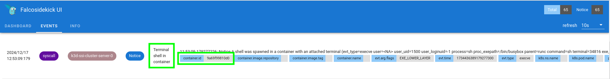
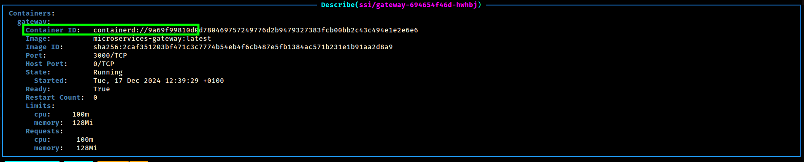

2. **Lecture de fichiers sensibles**
   - Cette règle Falco détecte la lecture de fichiers sensibles
   - Pour reproduire cette règle, vous pouvez exécuter la commande `cat /etc/shadow` dans un conteneur.
   
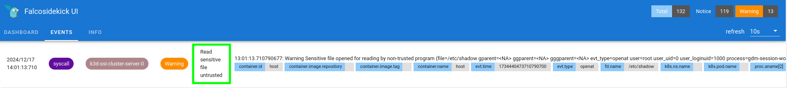

### Custom Falco Rules

Vous pouvez retrouver cette customes rules dans les values de falco dans le fichier `kubernetes/helmfiles/values/falco.yaml`.

> [!NOTE] 
> De la même manière que les règles par default vous pouvez consulter les règles personnalisées dans le fichier `etc/falco/rules.d/do-not-write-etc.yaml`.

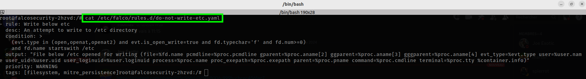

1. **Do not write to /etc**  
   - Cette règle Falco détecte l'écriture dans le répertoire `/etc`.  
   - Pour reproduire cette règle, vous pouvez exécuter la commande `touch /etc/<file-to-create>` dans un conteneur.

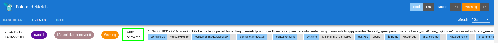


## Istio

> [!NOTE]
> Il est important de préciser que NATS gère nativement le chiffrement des données. Cependant, pour des raisons de démonstration, nous avons décidé de chiffrer le trafic entre les services en utilisant Istio.

Istio est installé dans le namespace `istio-system` avec l'interface web Kiali et une base de données de séries temporelles `Prometheus` qui enregistre les métriques des applications utilisant le service mesh.

Le namespace `ssi`, qui contient les pods de ce projet, est étiqueté avec `istio-injection=enabled`, ce qui indique à Istio d'injecter un conteneur proxy sidecar dans chaque pod déployé dans ce namespace. De plus, une politique Kyverno ajoute les labels `app` et `version` aux pods pour qu'Istio puisse ajouter des informations contextuelles aux métriques et à la télémétrie collectées.

### Peer Authentication

Pour garantir que toutes les communications entre les pods dans le namespace `ssi` sont sécurisées et chiffrées, nous utilisons une politique de Peer Authentication avec `mTLS` (mutual TLS) en mode `STRICT`. Cela assure que toutes les connexions entre les services sont authentifiées et chiffrées. (see [peer-authentication.yaml](./kubernetes/manifests/istio/peer-authentication.yaml))

Pour voir Istio en action, vous pouvez vous connecter à l'interface web Kiali en faisant un port-forwarding de son service avec la commande suivante :

```bash
kubectl port-forward svc/kiali -n istio-system 20001:20001
```


> [!WARNING] 
> Cependant, il semble que le trafic depuis l'interface web Kiali ne soit pas correctement affiché. Selon Kiali, les connexions ne sont pas affichées comme chiffrées par Istio. Cependant, lorsque nous executons une requête et analysons le réseau à partir d'un service kubernetes à l'aide de la commande `tcpdump`, nous pouvons voir que le trafic est belle et bien chiffré.

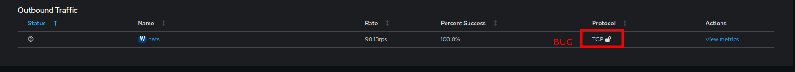

Pour justifier ce bug il faut passer les `istio-proxy` en mode `privileged=true`, afin de pouvoir run la commande `tcpdump` (see [istiod-proxy](./kubernetes/helmfiles/values/istiod.yaml)).

Pour vérifier que le trafic est bien chiffré, vous pouvez exécuter les commandes suivantes :

1. Requêtez le service `gateway` depuis un client HTTP :

```bash
curl -s -X GET http://localhost:3000/api/gateway/phrase
```

2. Exécutez la commande `tcpdump` depuis un pod Istio pour capturer le trafic :

```bash
sudo tcpdump dst port 4222  -A
```

3. Vous devriez voir le trafic chiffré entre les services :

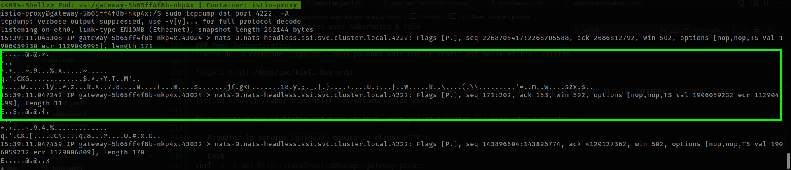

## Commandes utiles HELMFILE

- **Lister les releases :**  
```bash
helmfile list
```

- **Deployer/Supprimer une release en particulier :**  
```bash
helmfile -l name=<release-name> <sync|delete>
```

- **Linter les erreurs dans les fichiers Helmfile :**  
```bash
helmfile lint
```          

- **Montrer les valeurs de configuration :**   
```bash
helm show values <chart-name>
```