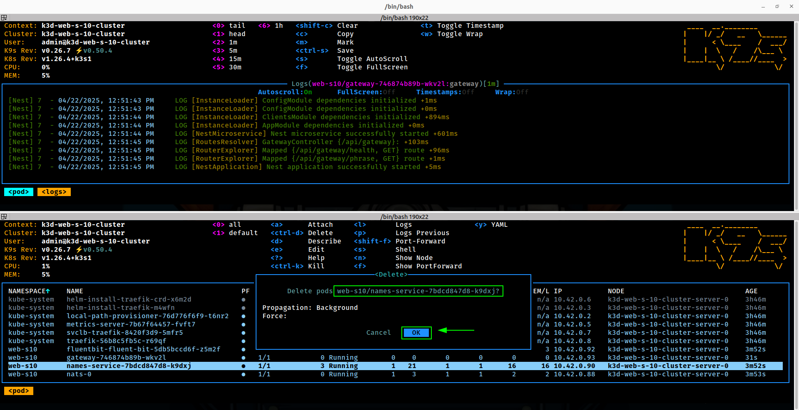
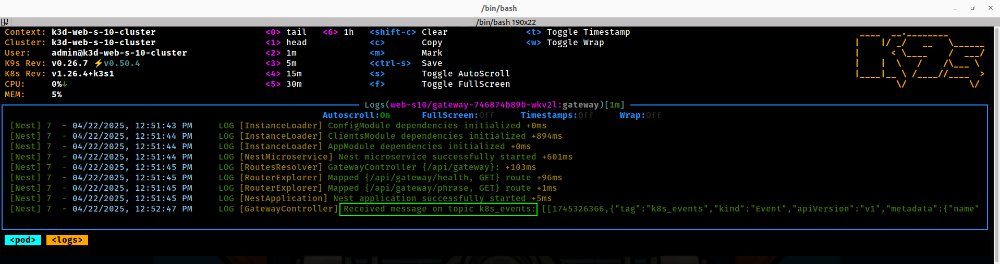

# K8s AI Events Relay

## Déployer l'application

1. Créer un cluster K3D avec 3 noeuds :  
```bash
k3d cluster create web-s-10-cluster 
```

> [!TIP]
>  Vous pouvez vérifier le contexte actuel de votre cluster avec la commande suivante :

 ```bash
kubectl config current-context
```

2. Build des images Docker depuis le folder `microservices` :

Build images :  

```bash
docker compose build
```

3. Importer les images dans le cluster K3D :

Depuis le folder `kubernetes/scripts` :

```bash
chmod +x import-kd3-images.sh && ./import-kd3-images.sh
```

5. Déployer les services depuis le folder `kubernetes/helmfiles` :  

```bash
helmfile sync
```

6. Port-forwarding pour accéder à l'application :  
```bash
kubectl port-forward svc/gateway 3000:3000
# Ou "Shift+F" pour port-forwarding depuis K9S.
# Puis pour tester l'API Gateway :
curl -s -X GET http://localhost:3000/api/gateway/phrase
```

> [!NOTE] 
> L'application est accessible à l'adresse `http://localhost:3000`

### Fluent Bit

1. Supprimer n'importe quel pod dans le namespace `web-s10` pour forcer son redémarrage.



2. Vérifier depuis les logs du consummer implémenté dans le microservice `Gateway` que les logs sont bien envoyés vers le topic `k8s_events` de Nats.  

