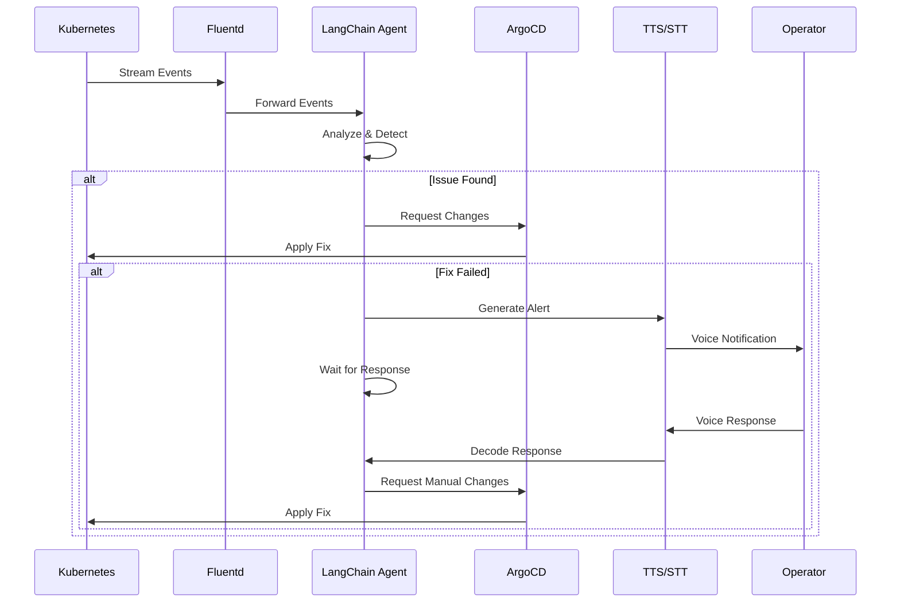
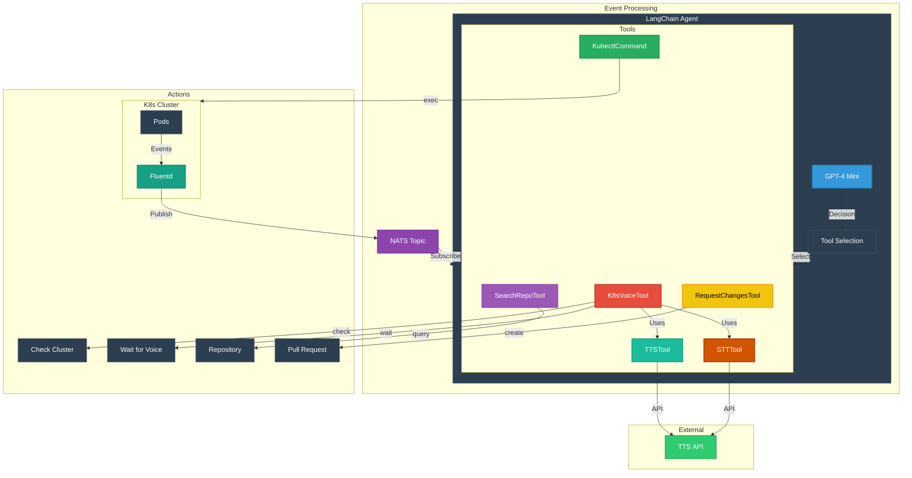
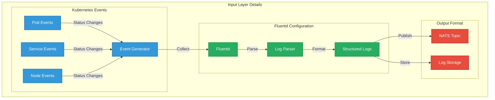
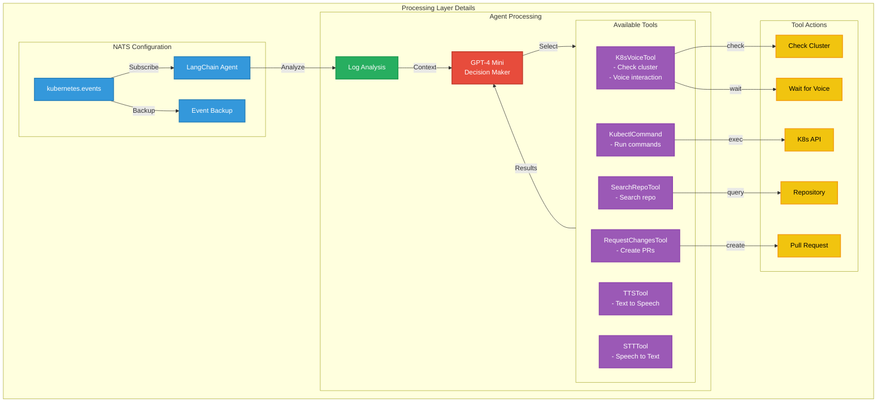

# AI-Powered Log Analysis & Issue Resolution

An intelligent system for automated monitoring and problem-solving

<div class="authors">
  Martin Moreira de Jesus · Charley Geoffroy · Pierrot Sylvain · Thomas Mauran
</div>

<div class="pt-12">
  <span @click="$slidev.nav.next" class="px-2 py-1 rounded cursor-pointer" hover="bg-white bg-opacity-10">
    Press Space for next page <carbon:arrow-right class="inline"/>
  </span>
</div>

<div class="abs-br m-6 flex gap-2">
  <button @click="$slidev.nav.openInEditor()" title="Open in Editor" class="text-xl slidev-icon-btn opacity-50 !border-none !hover:text-white">
    <carbon:edit />
  </button>
  <a href="https://github.com/slidevjs/slidev" target="_blank" alt="GitHub"
    title="View on GitHub" class="text-xl slidev-icon-btn opacity-50 !border-none !hover:text-white">
    <carbon-logo-github />
  </a>
</div>

---
layout: default
---

# System Overview

Our AI-powered system consists of several specialized services:

- 🤖 **Agent Service** - LangChain-powered AI for log analysis and issue resolution
- 💾 **Fluentd Service** - Aggregates logs from the cluster and forwards them to the NATS topic
- 🚪 **NATS Service** - NATS topic
- 🎙️ **TTS API** - Text-to-Speech for voice notifications
- 🎤 **STT API** - Speech-to-Text for operator responses

---
layout: default
---

# Event Flow Analysis

<div class="overflow-auto h-100">



</div>

---
layout: default
---

# Event Flow Architecture

<div class="overflow-auto">



</div>

---
layout: default
---

# Input Layer Analysis

<div class="overflow-auto">



</div>

---
layout: default
---

# Processing Layer Analysis

<div class="overflow-auto">



</div>

---
layout: default
---

# Agent Service (LangChain AI)

Core responsibilities:
- Log analysis and pattern recognition
- Issue detection and classification
- Automated fix attempts
- Verification of resolutions
- Natural language interaction

```python
# Key LangChain components:
- Log analysis chain
- Issue classification chain
- Fix generation chain
- Verification chain
- Voice interaction chain
```

---
layout: default
---


# Key Features

- 🤖 **AI-Powered Analysis**
  - LangChain for intelligent processing
  - Pattern recognition in logs
  - Automated issue detection

- 🎙️ **Voice Interface**
  - Natural language communication
  - Real-time operator interaction
  - Voice-based status updates

- 🔄 **Automated Resolution**
  - Self-healing capabilities
  - Verification of fixes
  - Fallback to human operators

---
layout: center
class: text-center
---

# Benefits

- 🚀 **Proactive Monitoring** - Early issue detection
- 🛠️ **Automated Resolution** - Self-healing system
- 🎯 **Human-AI Collaboration** - Natural interaction
- 📊 **Continuous Learning** - Pattern recognition
- ⚡ **Rapid Response** - Quick issue resolution
- 📈 **Scalable Architecture** - Microservices enable horizontal scaling

---
layout: default
---

# Challenges with LLM Integration

- ⏱️ **Performance Issues**
  - Slow response times
  - High latency in processing
  - Resource-intensive operations

- 🔄 **Inconsistent Behavior**
  - Non-deterministic outputs
  - Varying response quality
  - Different interpretations of same input

- 🎯 **Scoping Difficulties**
  - Hard to predict capabilities
  - Complex prompt engineering
  - Balancing flexibility vs. constraints

- 🛠️ **Development Challenges**
  - Difficult to debug
  - Hard to test thoroughly
  - Complex error handling

---
layout: center
class: text-center
---

# Live Demo

---
layout: default
---

# Conclusion

- 🎯 **Key Achievements**
  - Automated log analysis and issue detection
  - Voice-based human-AI interaction
  - GitOps-driven resolution workflow

- 🔮 **Future Directions**
  - Enhanced pattern recognition
  - Improved voice interaction
  - Extended automation capabilities

- 💡 **Key Takeaways**
  - AI can augment human operators
  - Voice interface enables natural interaction
  - Automated fixes reduce response time

---
layout: center
class: text-center
---

# Thank You!

Questions?

[Documentation](https://sli.dev) · [GitHub](https://github.com/slidevjs/slidev) 